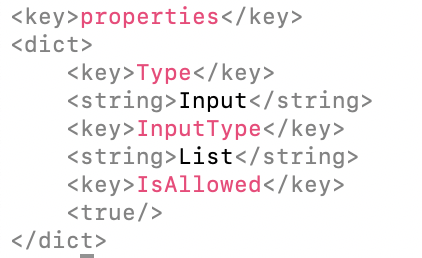

# Lux

A Swift library to colorise code blocks, with a dedicated command-line tool to colorise terminal output.

Currently supported:
- [x] Xml
- [x] Plist
- [x] Json

### Quick example
With the following Plist file

```xml
<key>properties</key>
<dict>
    <key>Type</key>
    <string>Input</string>
    <key>InputType</key>
    <string>List</string>
    <key>IsAllowed</key>
    <true/>
</dict>
```

Here is how the library could inject terminal colors:

```xml
\033[38;5;8m<key>\033[39m\033[38;5;161mproperties\033[39m\033[38;5;8m</key>\033[39m
\033[38;5;8m<dict>\033[39m
	\033[38;5;8m<key>\033[39m\033[38;5;161mType\033[39m\033[38;5;8m</key>\033[39m
	\033[38;5;8m<string>\033[39m\033[39mInput\033[39m\033[38;5;8m</string>\033[39m
	\033[38;5;8m<key>\033[39m\033[38;5;161mInputType\033[39m\033[38;5;8m</key>\033[39m
	\033[38;5;8m<string>\033[39m\033[39mList\033[39m\033[38;5;8m</string>\033[39m\
	\033[38;5;8m<key>\033[39m\033[38;5;161mIsAllowed\033[39m\033[38;5;8m</key>\033[39m
\033[38;5;8m<true/>\033[39m\n\033[38;5;8m</dict>\033[39m"
```



 Or Css classes:

```html
<span class="plist-tag">&lt;key&gt;</span><span class="plist-key-name">properties</span><span class="plist-tag">&lt;/key&gt;</span>
<span class="plist-tag">&lt;dict&gt;</span>
    <span class="plist-tag">&lt;key&gt;</span><span class="plist-key-name">Type</span><span class="plist-tag">&lt;/key&gt;</span>
    <span class="plist-tag">&lt;string&gt;</span><span class="plist-key-value">Input</span><span class="plist-tag">&lt;/string&gt;</span>
    <span class="plist-tag">&lt;key&gt;</span><span class="plist-key-name">InputType</span><span class="plist-tag">&lt;/key&gt;</span>
    <span class="plist-tag">&lt;string&gt;</span><span class="plist-key-value">List</span><span class="plist-tag">&lt;/string&gt;</span>
    <span class="plist-tag">&lt;key&gt;</span><span class="plist-key-name">IsAllowed</span><span class="plist-tag">&lt;/key&gt;</span>
    <span class="plist-tag">&lt;true/&gt;</span>
<span class="plist-tag">&lt;/dict&gt;</span>
```

For HTML text, the library will take a HTML string as input. In HTML, chevrons are written with `&lt;` for `<` and `&gt;` for `>`.

## How to use it

### Swift
They are two level of customisation to use **Lux**. The first and simpler one is to use the existing Injector classes. For each format, two injector exist today. One css classes injector to inject css classes into the string, and one to insert terminal colors.

#### First customisation level
To use them, instantiate one format injector, specifying the type of the text:

```swift
let injector = PlistInjector(target: .plainXml)
```
The text type can take `plain` and `html` options. You can then simply use the injector to modify the desired string:

```swift
let colorisedText = injector.inject(in: text)
```

Doing so, the injectors will inject default strings in the text. For example, the Xml css classes injector will inject two classes: `xml-tag` and `xml-key` while the Plist css injector will inject three: `plist-tag`, `plist-key-name` and `plist-key-value`. The same goes for terminal colors.

But it is possible to customise this behavior. This is the first customisation level. The injectors have delegate, which you can use to change the string which will be injected. For example, the Xml injector has an optional delegate with one function:

```swift
func injection(for category: XmlCategory) -> String
```

You can make a `struct` implement this protocol and return the string to inject for the given category. For Xml format, there are two options as you might imagine: `tag` and `key`. So for example, to change the css classes for the Xml format, here is what you could do.

```swift
struct  XmlCssDelegate: XmlDelegate {
    func injection(for category: XmlCategory) -> String {
        switch category {
            case .tag: return "specific-xml-tag"
            case .key: return "specific-xml-key"
	}
}

let injector = XmlInjector(target: .htmlXml, delegate: XmlCssDelegate())
let colorisedText = injector.inject(in: text)
```

#### Second level of customisation
If the delegate pattern does not suit your need, or if you need to customise more deeply, you can call the `Injector` service directly. It will take three parameters:
- `text` which is the text in which to inject strings
- `pattern` which is a `RegexPattern`. A wrapper around `String` to make it more specific. It is the pattern used by the regular expression to find matches
- `injectionClosure` to let you specify how to modify a match when the regular expression finds one

> Thanks to [John Sundell](https://github.com/JohnSundell) for the idea with the [Ink](https://github.com/JohnSundell/Ink) library!

For example, here is the quite simple implementation of `XmlInjector` which uses the `Injector` service:

```swift
struct XmlInjector {

    var target: RegexPattern
    var delegate: XmlDelegate? = nil

    func inject(in text: String) -> String {
        let modifiedText = try? Injector.inject(in: text, following: target) { match in
            let category = XmlCategory(from: match)
            let stringToInject: String

            if let delegate = self.delegate {
                stringToInject = delegate.injection(for: category)
            } else {
                stringToInject = category.injection(for: self.target.type)
            }

            let modifiedMatch = self.target.type.inject(stringToInject, in: match)

            return modifiedMatch
        }

        guard let finalText = modifiedText else {
            assertionFailure("The default regular expression pattern \(target.stringValue) has failed to build a regular expression")
            return text
        }
        return finalText
    }
}
```

### Command-line


## Miscellaneous
[Useful link](https://stackoverflow.com/questions/4842424/list-of-ansi-color-escape-sequences) to colorise the output in the terminal.
