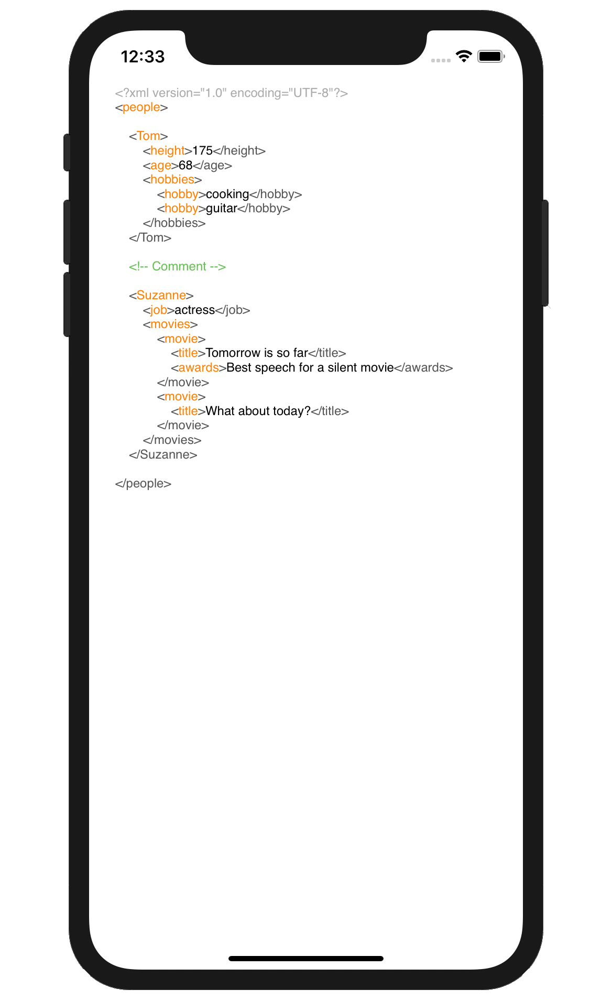
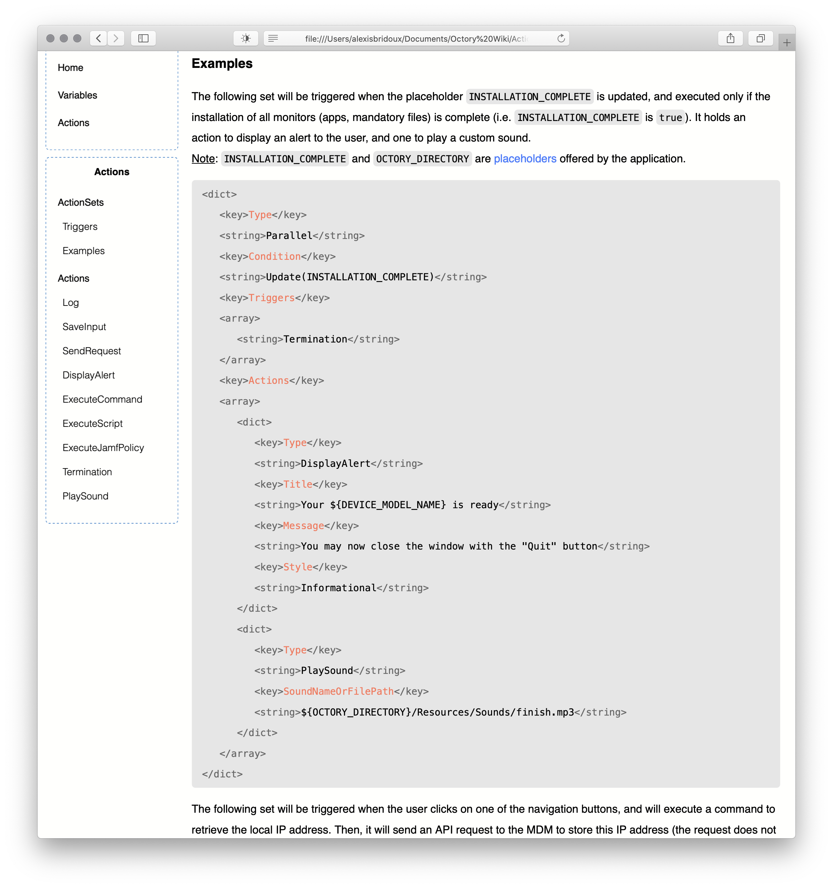
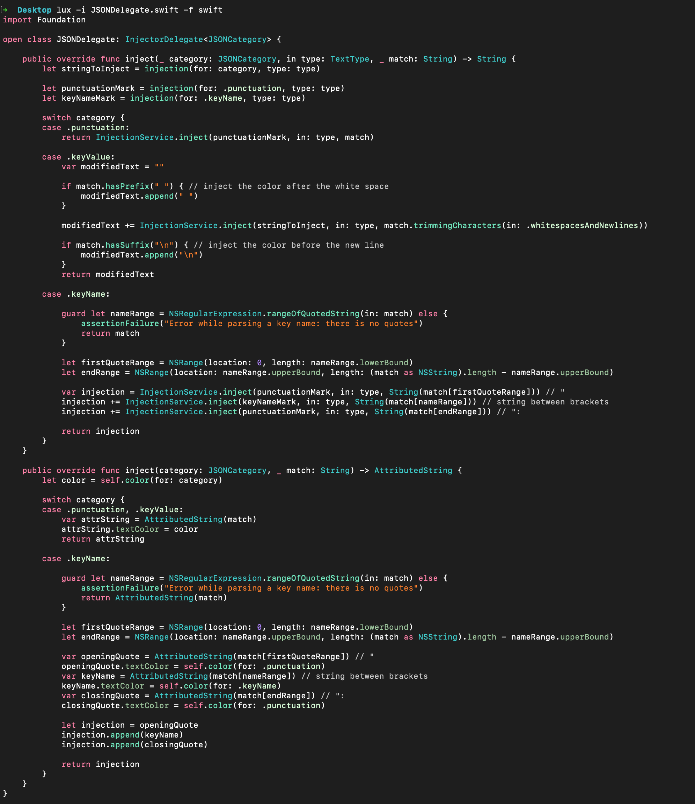
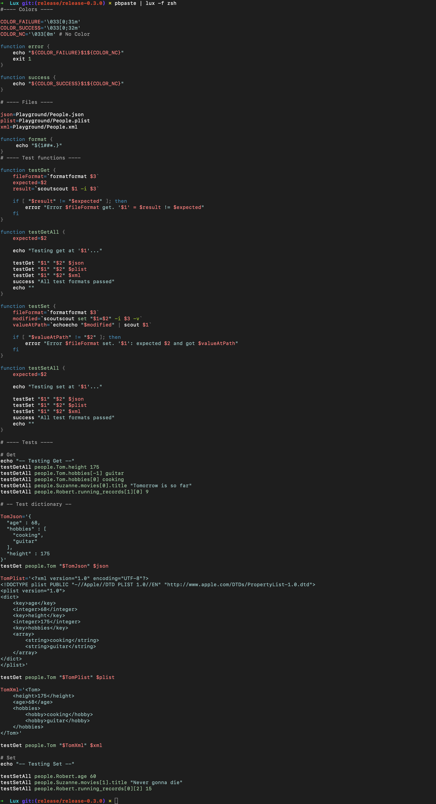

<p  align="center">
Swift package<br>
    <a href="#">
        
    </a>
    <a href="https://swift.org/package-manager">
        
    </a>
    <br/><br/>
Install<br/>
    <a href="#">
        
    </a>
     <a href="https://github.com/ABridoux/scout/releases">
        
    </a>
    <br/>
</p>

# Lux <a href="https://github.com/ABridoux/scout/releases"></a>

A Swift library with a dedicated command-line tool to colorise plain code (e.g. for terminal output), HTML files code blocks or attributed strings (e.g. for macOS or iOS apps).

Currently supported languages:
- [x] Zsh/Bash
- [x] Swift (with [Splash](https://github.com/JohnSundell/Splash))
- [x] Xml
- [x] Xml enhanced (better visualisation of the tags)
- [x] Plist
- [x] Json

Currently offered themes:
- [x] Dracula
- [x] Xcode light (default)
- [x] Xcode dark

Theme to be added:
- [] Obsidian
- [] Tomorrow

You can ask for a language or a theme by [opening an issue](https://github.com/ABridoux/lux/issues).
The following screenshots show the different usages of **Lux**.

<p align="center">


<br />
<em>Plist in macOS app</em></p>
<br />

<p align="center">

<br />
<em>iOS app with an enhanced XML format</em></p>
<br />

<p align="center">

<br />
<em><a href="https://www.octory.io">Octory</a> (new) wiki sample</em></p>
<br />

<p align="center">

<br />
<em>Swift in the terminal</em></p>
<br />

<p align="center">

<br />
<em>Zsh on iPad. A script from Scripting OSX to <a href="https://scriptingosx.com/2019/09/notarize-a-command-line-tool/">notarise a command-line tool</a>.</em></p>
<br />

<p align="center">

<br />
<em>Zsh in the terminal</em></p>
<br />

<br />

### Quick example
With the following Plist file

```xml
<key>properties</key>
<dict>
    <key>Type</key>
    <string>Input</string>
    <key>InputType</key>
    <string>List</string>
    <key>IsAllowed</key>
    <true/>
</dict>
```

Here is how the library could inject terminal colors:

```xml
\033[38;5;8m<key>\033[39m\033[38;5;161mproperties\033[39m\033[38;5;8m</key>\033[39m
\033[38;5;8m<dict>\033[39m
	\033[38;5;8m<key>\033[39m\033[38;5;161mType\033[39m\033[38;5;8m</key>\033[39m
	\033[38;5;8m<string>\033[39m\033[39mInput\033[39m\033[38;5;8m</string>\033[39m
	\033[38;5;8m<key>\033[39m\033[38;5;161mInputType\033[39m\033[38;5;8m</key>\033[39m
	\033[38;5;8m<string>\033[39m\033[39mList\033[39m\033[38;5;8m</string>\033[39m\
	\033[38;5;8m<key>\033[39m\033[38;5;161mIsAllowed\033[39m\033[38;5;8m</key>\033[39m
\033[38;5;8m<true/>\033[39m\n\033[38;5;8m</dict>\033[39m"
```

 Or Css classes:

```html
<span class="plist-tag">&lt;key&gt;</span><span class="plist-key-name">properties</span><span class="plist-tag">&lt;/key&gt;</span>
<span class="plist-tag">&lt;dict&gt;</span>
    <span class="plist-tag">&lt;key&gt;</span><span class="plist-key-name">Type</span><span class="plist-tag">&lt;/key&gt;</span>
    <span class="plist-tag">&lt;string&gt;</span><span class="plist-key-value">Input</span><span class="plist-tag">&lt;/string&gt;</span>
    <span class="plist-tag">&lt;key&gt;</span><span class="plist-key-name">InputType</span><span class="plist-tag">&lt;/key&gt;</span>
    <span class="plist-tag">&lt;string&gt;</span><span class="plist-key-value">List</span><span class="plist-tag">&lt;/string&gt;</span>
    <span class="plist-tag">&lt;key&gt;</span><span class="plist-key-name">IsAllowed</span><span class="plist-tag">&lt;/key&gt;</span>
    <span class="plist-tag">&lt;true/&gt;</span>
<span class="plist-tag">&lt;/dict&gt;</span>
```

You can then customise those classes in your CSS file. This [wiki page](https://github.com/ABridoux/lux/wiki/%5B40%5D-CSS-classes) describes each format CSS classes.

<u>Note</u>: For HTML text, the library will take a **HTML string as input**. In HTML, `&` is specified with `&amp;`, chevrons are written with `&lt;` for `<` and `&gt;` for `>`. Thus, when using a HTML injector, you can call its function `escapingHTML()` if you give it plain text as input. Otherwise, nothing has to be done when the input is alread HTML encoded.

For the command line tool `inject` command, the default behavior is to replace those special characters before injecting colors. You can change this behavior with the `--no-escape-html` flag if you already have a HTML-encoded string as input. To escape those characters, Lux uses the following [extension](https://github.com/JohnSundell/Splash/blob/master/Sources/Splash/Extensions/Strings/String%2BHTMLEntities.swift).

<br />

## How to install it

#### Homebrew

Use the following command.

```bash
brew install ABridoux/formulae/lux
```
It will **download the notarized executable** from the [latest release](https://github.com/ABridoux/scout/releases/latest/download/lux.zip).

#### Download

You can download the [latest version of the executable](https://github.com/ABridoux/lux/releases/latest/download/lux.zip) from the [releases](https://github.com/ABridoux/lux/releases). Note that the **executable is notarized**. Also, a notarized [lux package](https://github.com/ABridoux/lux/releases/latest/download/lux.pkg) is provided.

After having unzipped the file, you can install it if you want to:

```bash
install lux /usr/local/bin/ 
```

Here is a command which downloads the latest version of the program and install it in */usr/local/bin*. 
Run it to download and install the latest version of the program. It erases the current version you may have.

```bash
curl -LO https://github.com/ABridoux/lux/releases/latest/download/lux.zip && \
unzip lux.zip && \
rm lux.zip && \
install lux /usr/local/bin && \
rm lux
```

##### Note
- To find all lux versions, please browse the [releases](https://github.com/ABridoux/lux/releases) page.
- When deploying a package (with a MDM for example), it might be useful to add the version to the name. To get lux latest version: simply run `lux version` to get your **installed lux version**.
Also, if you are using [scout](https://github.com/ABridoux/scout), you can run ` curl --silent "https://api.github.com/repos/ABridoux/lux/releases/latest" | scout tag_name` to get the latest version **available on the Github repository**.


### Swift package

Start by importing the package in your file *Packages.swift*.
```swift
let package = Package (
    ...
    dependencies: [
        .package(url: "https://github.com/ABridoux/lux", from: "0.1.0")
    ],
    ...
)
```
You can then `import Lux` in a file.

<br />


## How to use it

[Command-line](https://github.com/ABridoux/lux/wiki/%5B20%5D-Usage:-command-line)

[Swift package](https://github.com/ABridoux/lux/wiki/%5B21%5D-Usage:-Swift-package)

## Special thanks

Thanks to all the contributors of Lux, especially to [Damien Rivet](https://github.com/Ethenyl) who makes code reviews when he has the time. Also, many thanks to the team behind [swift-argument-parser](https://github.com/apple/swift-argument-parser) who keeps doing an incredible work.
Also, many thanks to John Sundell for his several articles regarding an API development, and for the [Splash](https://github.com/JohnSundell/Splash) library as well as all its contributors.

## Contributing

### Report a bug
Lux  aims to be community project, and anyone is welcome to contribute. As it is still a young project, some bugs may appear, or some text not colorised correctly. If you encounter such problem, please [open a issue](https://github.com/ABridoux/lux/issues) to describe it and try to add a use case to reproduce the bug. Hopefully, it should be resolved in the following release.

### Add a new language or theme
You can read [here](https://github.com/ABridoux/lux/wiki/%5B30%5D-Add-a-new-language) how to add a new language to Lux. A wiki page explaining theming will be available soon.

## Miscellaneous

- [Colorize terminal with Swift](https://stackoverflow.com/questions/4842424/list-of-ansi-color-escape-sequences) to colorise the output in the terminal.
- [Terminal colors list](https://misc.flogisoft.com/bash/tip_colors_and_formatting)
- [Encode code block to HTML](https://www.opinionatedgeek.com/codecs/htmlencoder)
