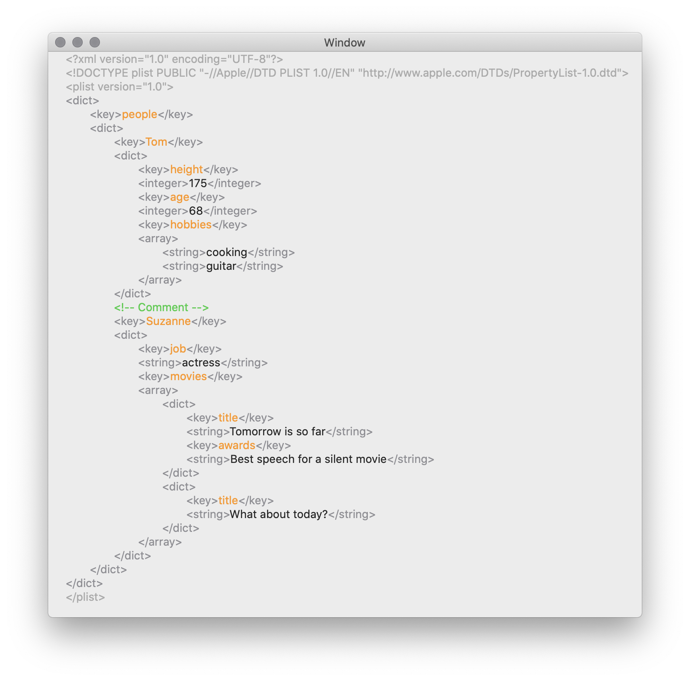

<p>
Swift package:<br>
    <a href="#">
        
    </a>
    <a href="https://swift.org/package-manager">
        
    </a>
    <br/>
Install:<br>
    <a href="#">
        
    </a>
     <a href="https://github.com/ABridoux/scout/releases">
        
    </a>
    <br/>
</p>


# Lux

A Swift library with a dedicated command-line tool to colorise plain code (e.g. for terminal output), HTML files code blocks or attributed strings (e.g. for macOS or iOS apps).

Currently supported:
- [x] Xml
- [x] Xml enhanced (better visualisation of the tags)
- [x] Plist
- [x] Json

To be added:
- [ ] Zsh
- [ ] Swift

You can ask for a language by [opening an issue](https://github.com/ABridoux/lux/issues).
The following screenshots show the different usages of **Lux**.

<div style="text-align: center;">

<p><em>Output in the terminal with a JSON format</em></p>
<br />

<p><em>macOS app with a Plist format</em></p>
<br />

<p><em>iOS app with an enhanced XML format</em></p>
<br />

<p><em><a href="https://www.octory.io">Octory</a> (new) wiki sample</em></p>
</div>

<br />

### Quick example
With the following Plist file

```xml
<key>properties</key>
<dict>
    <key>Type</key>
    <string>Input</string>
    <key>InputType</key>
    <string>List</string>
    <key>IsAllowed</key>
    <true/>
</dict>
```

Here is how the library could inject terminal colors:

```xml
\033[38;5;8m<key>\033[39m\033[38;5;161mproperties\033[39m\033[38;5;8m</key>\033[39m
\033[38;5;8m<dict>\033[39m
	\033[38;5;8m<key>\033[39m\033[38;5;161mType\033[39m\033[38;5;8m</key>\033[39m
	\033[38;5;8m<string>\033[39m\033[39mInput\033[39m\033[38;5;8m</string>\033[39m
	\033[38;5;8m<key>\033[39m\033[38;5;161mInputType\033[39m\033[38;5;8m</key>\033[39m
	\033[38;5;8m<string>\033[39m\033[39mList\033[39m\033[38;5;8m</string>\033[39m\
	\033[38;5;8m<key>\033[39m\033[38;5;161mIsAllowed\033[39m\033[38;5;8m</key>\033[39m
\033[38;5;8m<true/>\033[39m\n\033[38;5;8m</dict>\033[39m"
```

 Or Css classes:

```html
<span class="plist-tag">&lt;key&gt;</span><span class="plist-key-name">properties</span><span class="plist-tag">&lt;/key&gt;</span>
<span class="plist-tag">&lt;dict&gt;</span>
    <span class="plist-tag">&lt;key&gt;</span><span class="plist-key-name">Type</span><span class="plist-tag">&lt;/key&gt;</span>
    <span class="plist-tag">&lt;string&gt;</span><span class="plist-key-value">Input</span><span class="plist-tag">&lt;/string&gt;</span>
    <span class="plist-tag">&lt;key&gt;</span><span class="plist-key-name">InputType</span><span class="plist-tag">&lt;/key&gt;</span>
    <span class="plist-tag">&lt;string&gt;</span><span class="plist-key-value">List</span><span class="plist-tag">&lt;/string&gt;</span>
    <span class="plist-tag">&lt;key&gt;</span><span class="plist-key-name">IsAllowed</span><span class="plist-tag">&lt;/key&gt;</span>
    <span class="plist-tag">&lt;true/&gt;</span>
<span class="plist-tag">&lt;/dict&gt;</span>
```

You can then customise those classes in your CSS file. The wiki describes each format CSS classes.

<u>Note</u>: For HTML text, the library will take a **HTML string as input**. In HTML, chevrons are written with `&lt;` for `<` and `&gt;` for `>`. 

<br />

## How to install it

#### Homebrew

Use the following command.

```bash
brew install ABridoux/formulae/lux
```
It will **download the notarized executable** from the [latest release](https://github.com/ABridoux/scout/releases/latest/download/lux.zip).

#### Download

You can download the [latest version of the executable](https://github.com/ABridoux/lux/releases/latest/download/lux.zip) from the [releases](https://github.com/ABridoux/lux/releases). Note that the **executable is notarized**. Also, a notarized [lux package](https://github.com/ABridoux/lux/releases/latest/download/lux.pkg) is provided.

After having unzipped the file, you can install it if you want to:

```bash
install lux /usr/local/bin/ 
```

Here is a command which downloads the latest version of the program and install it in */usr/local/bin*. 
Run it to download and install the latest version of the program. It erases the current version you may have.

```bash
curl -LO https://github.com/ABridoux/lux/releases/latest/download/lux.zip && \
unzip lux.zip && \
rm lux.zip && \
install lux /usr/local/bin && \
rm lux
```

##### Note
- To find all lux versions, please browse the [releases](https://github.com/ABridoux/lux/releases) page.
- When deploying a package (with a MDM for example), it might be useful to add the version to the name. To get lux latest version: simply run `lux version` to get your **installed lux version**.
Also, if you are using [scout](https://github.com/ABridoux/scout), you can run ` curl --silent "https://api.github.com/repos/ABridoux/lux/releases/latest" | scout tag_name` to get the latest version **available on the Github repository**.


### Swift package

Start by importing the package in your file *Packages.swift*.
```swift
let package = Package (
    ...
    dependencies: [
        .package(url: "https://github.com/ABridoux/lux", from: "0.1.0")
    ],
    ...
)
```
You can then `import Lux` in a file.

<br />


## How to use it

### Command-line

The program has two commands: `inject` (default) to inject color marks in an input stream then output it, and `css` to look for tag code blocks in an input HTML file, to inject color marks (span tags) in them.

#### Inject command

You can use it with an input stream or with the `--input | -i` option. You have to specify the data format with the `--format | -f` option.

`cat File.json | lux -f json` is equivalent to `lux -i File.json -f json`

For example, to get information about this repository, and colorise the output, here is the command:

`curl --silent "https://api.github.com/repos/ABridoux/lux/releases/latest" | lux -f json`.

You can also use this command to inject span tags in a html code block with the `--type | -t` option. For example, if you have the following code block:

```xml
<key>properties</key>
<dict>
    <key>Type</key>
    <string>Input</string>
    <key>InputType</key>
    <string>List</string>
    <key>IsAllowed</key>
    <true/>
</dict>
```

You can use this [website](https://www.opinionatedgeek.com/codecs/htmlencoder) to get its HTML encoded version:

```html
&lt;key&gt;properties&lt;/key&gt;
&lt;dict&gt;
    &lt;key&gt;Type&lt;/key&gt;
    &lt;string&gt;Input&lt;/string&gt;
    &lt;key&gt;InputType&lt;/key&gt;
    &lt;string&gt;List&lt;/string&gt;
    &lt;key&gt;IsAllowed&lt;/key&gt;
    &lt;true/&gt;
&lt;/dict&gt;
```

Then copy it, and run `pbpaste | lux -f plist -t html | pbcopy`. This will copy the following in your clipboard:

```html
<span class="plist-tag">&lt;key&gt;</span><span class="plist-key-name">properties</span><span class="plist-tag">&lt;/key&gt;</span>
<span class="plist-tag">&lt;dict&gt;</span>
    <span class="plist-tag">&lt;key&gt;</span><span class="plist-key-name">Type</span><span class="plist-tag">&lt;/key&gt;</span>
    <span class="plist-tag">&lt;string&gt;</span><span class="plist-key-value">Input</span><span class="plist-tag">&lt;/string&gt;</span>
    <span class="plist-tag">&lt;key&gt;</span><span class="plist-key-name">InputType</span><span class="plist-tag">&lt;/key&gt;</span>
    <span class="plist-tag">&lt;string&gt;</span><span class="plist-key-value">List</span><span class="plist-tag">&lt;/string&gt;</span>
    <span class="plist-tag">&lt;key&gt;</span><span class="plist-key-name">IsAllowed</span><span class="plist-tag">&lt;/key&gt;</span>
    <span class="plist-tag">&lt;true/&gt;</span>
<span class="plist-tag">&lt;/dict&gt;</span>
```

You can then paste it anywhere you want. The list of the default CSS classes can be found in the [wiki](https://github.com/ABridoux/lux/wiki/CSS-classes).

#### Css command

This command will take a HTML file as input, parse it to find the `<pre><code class="[FORMAT]">` blocks, and inject the span tags for you to use it in CSS. Let's say that you have an article.html with Plist and Json code blocks in it. To inject the span tags, you would run:

```bash
lux css -i article.html -f plist
```

And then for the Json code blocks:

```bash
lux css -i article.html -f json
```

(A future version should let you do that in one command like: `lux css -i article.html -f plist json`).

<br />

### Swift
They are two levels of customisation to use **Lux**. The first uses the default `Injector` classes. You can customise the injection in a closure called each time a match is found. By implementing the corresponding delegate of the `Injector`, you can either specify the string that will be used by the `Injector` when modifying the match, or modify the match directly. The second let you modify directly a match. For each format, two injectors exist today: a css classes injector to inject css classes into the string and one to insert terminal colors.

#### First customisation level
To use them, instantiate one format injector, specifying the type of the text.

```swift
let injector = PlistInjector(type: .plain)
```
The text type can take `plain` and `html` options. You can then simply use the injector to modify the desired string:

```swift
let colorisedText = injector.inject(in: text)
```

Doing so, the injectors will inject default strings in the text. For example, the Xml css classes injector will inject four classes: `xml-tag`, `xml-key`, `xml-header` and `xml-comments` while the Plist css injector will inject 5: `plist-tag`, `plist-key-name` and `plist-key-value`, `plist-header` and `plist-comments`. The same goes for terminal colors.

It is possible to customise this behavior. This is the first customisation level. An `Injector` has a delegate, which you can use to change the string (or color for attributed strings) which will be injected, as well as how it is injected.

You can subclass a delegate class associated to a data format. All delegates have the same optional functions, while the `Category` they hold is the only difference. For example, to change the colors set to the attributed strings in Json data with an iOS app, you could write:

```swift
class JSONDelegateColor: JSONDelegate {
    override func color(for category: JSONCategory) -> Color {
        switch category {
        case .punctuation:
            return UIColor.systemPink
        case .keyName:
            return UIColor.systemTeal
        case .keyValue:
            return UIColor.label
        }
    }
}

let injector = JSONInjector(target: .plain, delegate: JSONDelegateColor())
let colorisedText = injector.inject(in: text)
```

Also, you could go a bit further and choose how to modify the match associated to the category with the following  function (optional). It will pass the string to be injected as a parameter, as it does for the default function.

```swift
class JSONDelegateColor: JSONDelegate {
    override func inject(_ category: JSONCategory, in type: TextType, _ text: String) -> String {
        let stringToInject = injection(for: category, type: type) // other optional function
            
        switch type {
        case .plain:
            return stringToInject + text + Colors.terminalReset
        case .html:
            return #"<span class="\#(stringToInject)">\#(text)</span>"#
        }
	}
}

let injector = JSONInjector(target: .plain, delegate: JSONDelegateColor())
let colorisedText = injector.inject(in: text)
```

#### Second  customisation level
If the delegate pattern does not suit your need, or if you need to customise more deeply, you can call the `Injector` service directly. It will take three parameters:
- `text` which is the text in which to inject strings
- `pattern` which is a `RegexPattern`. A wrapper around `String` to make it more specific. It is the pattern used by the regular expression to find matches
- `injectionClosure` to let you specify how to modify a match when the regular expression finds one

> Thanks to [John Sundell](https://github.com/JohnSundell) for the idea with the [Ink](https://github.com/JohnSundell/Ink) library!

You can subclass the `BaseInjector<Cat: Category>` class to use its built-in functions, or make your own class or struct to implement the `Injector` protocol.

For example, here is the quite simple implementation of `XMLInjector` which subclasses the `BaseInjector<Cat: Category>`:

```swift
public final class XMLInjector: BaseInjector<XMLCategory> {

    override var defaultLanguageIdentifiers: Set<String> { ["xml", "Xml", "XML", "language-xml", "language-Xml", "language-XML"] }
    override var plainRegexPattern: RegexPattern { .plainXml }
    override var htmlRegexPattern: RegexPattern { .htmlXml }

    override public init(type: TextType, delegate: BaseInjector<XMLCategory>.Delegate = XMLDelegate()) {
        super.init(type: type, delegate: delegate)
    }
}

```

## Miscellaneous

- [Colorize terminal with Swift](https://stackoverflow.com/questions/4842424/list-of-ansi-color-escape-sequences) to colorise the output in the terminal.
- [Terminal colors list](https://misc.flogisoft.com/bash/tip_colors_and_formatting)
- [Encode code block to HTML](https://www.opinionatedgeek.com/codecs/htmlencoder)
